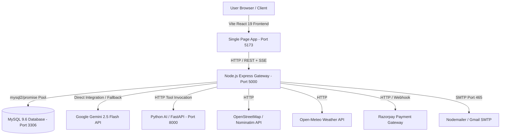

# FARMCONNECT — POST-PHASE BASELINE SNAPSHOT
**Authoritative Platform Inventory & Production Baseline**  
**Date:** October 3, 2026  
**Status:** ALL PLANNED 3C, 3D, 3E-1, 3E-2, and 3E-3 WORK COMPLETE  
**Current Milestone:** POST-PHASE BASELINE SNAPSHOT  

---

## Executive Summary

FarmConnect has completed Phases 3C, 3D (3D-1, 3D-2, 3D-3, 3D-4), 3E-1, 3E-2, and 3E-3.
This document serves as the authoritative baseline snapshot inventory. No code has been modified during this snapshot.

### Verified Production Baseline
- **Backend Regression Suite**: **611 / 611 PASS (100%)**
- **Security Hardening Suite**: **17 / 17 PASS (100%)**
- **Python AI Microservice Tests**: **276 / 276 PASS (100%)**
- **Frontend Production Build**: **PASS (201 modules transformed in 604ms, 0 errors)**
- **Targeted ESLint**: **0 errors, 0 warnings**
- **Database Engine**: **MySQL 9.6 Authoritative (27 InnoDB tables, 14 users)**
- **P0 / P1 / P2 Open Defects**: **0 (DEF-AI-01 & DEF-AI-02 closed)**
- **Phase 3E-4 Status**: **NOT STARTED**

---

## 1. Current Git & Working-Tree Status

### Branch
- **Branch**: `main` (Up to date with `origin/main`)

### Tracked Modified Files
```
modified:   .env.example
modified:   .gitignore
modified:   backend/ai/aiPermissions.js
modified:   backend/ai/aiRouter.js
modified:   backend/ai/aiService.js
modified:   backend/ai/aiTools.js
modified:   backend/database.js
modified:   backend/database.sqlite
modified:   backend/middleware/auth.js
modified:   backend/package-lock.json
modified:   backend/package.json
modified:   backend/routes/chatRouter.js
modified:   backend/routes/otpRouter.js
modified:   backend/routes/paymentRouter.js
modified:   backend/server.js
modified:   backend/services/locationService.js
modified:   backend/services/otpService.js
modified:   backend/services/paymentService.js
modified:   backend/services/realtimeService.js
modified:   backend/test-chat.js
modified:   backend/test-phase1.js
modified:   backend/test-phase2.js
modified:   backend/utils/security.js
modified:   eslint.config.js
modified:   package-lock.json
modified:   package.json
modified:   src/components/ai/AiChatDrawer.jsx
modified:   src/components/common/GlobalLocationSelector.jsx
modified:   src/components/common/MapBoxView.jsx
modified:   src/components/common/Toast.jsx
modified:   src/components/common/index.js
modified:   src/components/icons/Icons.jsx
modified:   src/components/layout/Navbar.jsx
modified:   src/components/layout/Sidebar.jsx
modified:   src/components/product/ProductCard.jsx
modified:   src/context/AuthContext.jsx
modified:   src/context/DataContext.jsx
modified:   src/context/LanguageContext.jsx
modified:   src/context/NotificationContext.jsx
modified:   src/pages/admin/AdminDashboard.jsx
modified:   src/pages/chat/ChatPage.jsx
modified:   src/pages/common/ProfileSettings.jsx
modified:   src/pages/farmer/FarmerDashboard.jsx
modified:   src/pages/farmer/FarmerOrders.jsx
modified:   src/pages/farmer/MyFarm.jsx
modified:   src/pages/farmer/MyProducts.jsx
modified:   src/pages/public/ForgotPassword.jsx
modified:   src/pages/public/Login.jsx
modified:   src/pages/public/Register.jsx
modified:   src/pages/vendor/CartPage.jsx
modified:   src/pages/vendor/Checkout.jsx
modified:   src/pages/vendor/Marketplace.jsx
modified:   src/pages/vendor/OrderHistory.jsx
modified:   src/pages/vendor/OrderTracking.jsx
modified:   src/pages/vendor/ProductDetails.jsx
modified:   src/pages/vendor/VendorDashboard.jsx
modified:   src/routes/AppRoutes.jsx
modified:   src/services/api.js
modified:   src/services/locationService.js
modified:   src/services/realtime.js
modified:   src/styles/global.css
modified:   src/styles/variables.css
modified:   vite.config.js
```

### Untracked Files & Artifacts
- **Phase Reports**:
  - `FRONTEND_PRODUCT_INTEGRATION_AUDIT.md`
  - `LIVE_DEMO_CHECKLIST.md`
  - `PHASE11_IMPLEMENTATION_REPORT.md`
  - `PHASE12_PRODUCTION_HARDENING_REPORT.md`
  - `PHASE_3C_1_FINAL_REPORT.md`
  - `PHASE_3C_2_FINAL_REPORT.md`
  - `PHASE_3C_3_FINAL_REPORT.md`
  - `PHASE_3C_AUDIT_REPORT.md`
  - `PHASE_3D1_IMPLEMENTATION_REPORT.md`
  - `PHASE_3D2_IMPLEMENTATION_REPORT.md`
  - `PHASE_3D3_SIGNATURE_EXPERIENCE_REPORT.md`
  - `PHASE_3D4_DATABASE_AUDIT_REPORT.md`
  - `PHASE_3D4_MYSQL_PRODUCTION_VALIDATION_REPORT.md`
  - `PHASE_3E1_MYSQL_BACKUP_RESTORE_REPORT.md`
  - `PHASE_3E2_SECURITY_AUDIT_REPORT.md`
  - `PHASE_3E2_SECURITY_HARDENING_REPORT.md`
  - `PHASE_3E2_VERIFICATION_REPORT.md`
  - `PHASE_3E3_E2E_PRODUCTION_QA_AUDIT_REPORT.md`
  - `PHASE_3E3_REMEDIATION_REPORT.md`
  - `docs/MYSQL_BACKUP_RESTORE_RUNBOOK.md`
- **Backend AI & Services Additions**:
  - `backend/ai-python/` (FastAPI microservice, venv, tests)
  - `backend/ai/aiActions.js`, `geminiClient.js`
  - `backend/middleware/imageRateLimiter.js`, `ttsRateLimiter.js`, `voiceRateLimiter.js`
  - `backend/services/` (18 services: aiFollowup, aiGoal, aiMemory, aiPlanner, analyticsReport, cropImageAnalysis, deliveryPricing, emailService, locationService, mapService, marketplaceAgent, otpService, paymentService, proactiveInsight, realtimeService, transcriptionService, ttsService, weatherService)
  - `backend/schema.sql`, `backend/clear_farmconnect_data.js`, `backend/migrate-sqlite-to-mysql.js`, `backend/database.sqlite.backup-phase3d4`
  - Verification & Test Suites (`test-all-phases.js`, `test-phase3e2-security.js`, `test-remediation.js`, `qa-audit-phase3e3.js`, etc.)
- **Frontend Components**:
  - `src/components/ai/` (ActionConfirmationCard, AiActionCenter, AiMemoryManager, CropImageAnalyzer, FarmCopilotDashboard, MarketplaceAgent)
  - `src/components/analytics/` (7 analytics components)
  - `src/components/farmer/` (FarmDecisionCard, FarmDecisionEngine, FarmDecisionMap, SmartInsightsSection)
  - `src/components/common/OsmLocationPicker.jsx`, `OsmRouteMap.jsx`
  - `src/components/product/ProductTranslationsModal.jsx`
- **Shell Redirection Artifacts (Zero-byte/Stray files)**:
  - `c.Field))`
  - `console.log('Backend`
  - `{`

---

## 2. Current Application Architecture



### Architectural Division of Responsibility
1. **Node.js Gateway (`backend/server.js`)**:
   - **Authoritative Business Engine**: Sole authority for database writes, transactions, session cookies, password hashing (Argon2id), RBAC enforcement, and rate limiting.
   - **Real-Time Stream**: Server-Sent Events (SSE) broadcaster for multi-client events (`/api/realtime/stream`).
   - **AI Orchestration**: Orchestrates Gemini calls, autonomous tool executions, and pending action proposals.
2. **MySQL Database (`farmconnect` on `127.0.0.1:3306`)**:
   - Sole source of truth for persistent application state, transactions, audit logs, and relations.
3. **Python AI Microservice (`backend/ai-python`)**:
   - **Read-Only Reasoning Engine**: Implements fast NLP entity extraction, intent recognition, mathematical pricing models, and specialized agricultural tool definitions.
   - Operates in read-only / stateless mode; does not perform persistent state mutations.
4. **React Frontend (`src/`)**:
   - Single-Page Application using React Router v6 with code-splitting lazy routes, role guards, responsive CSS variables, Leaflet/OSM mapping, and real-time SSE listener.

---

## 3. Frontend Routes & Features

### Complete Route Map (`src/routes/AppRoutes.jsx`)

| Path | Component | Guard / Access | Feature |
|---|---|---|---|
| `/` | `LandingPage.jsx` | Public | Hero, platform value props, category carousel, live stats |
| `/login` | `Login.jsx` | Public (Redirect if Auth) | Argon2id credential login with demo role switcher |
| `/register` | `Register.jsx` | Public (Redirect if Auth) | Role-specific registration (Farmer vs Vendor) with security question |
| `/forgot-password` | `ForgotPassword.jsx` | Public | Password recovery via security question & answer |
| `/support` | `Support.jsx` | Public | FAQs, customer contact channels, platform documentation |
| `/farmer-profile/:farmerId` | `FarmerProfile.jsx` | Public / Multi-role | Farmer public storefront, ratings, bio, active crop listings |
| `/farmer/dashboard` | `FarmerDashboard.jsx` | Farmer RoleGuard | Farm Decision Engine, Copilot summary, orders, quick stats |
| `/farmer/farm` | `MyFarm.jsx` | Farmer RoleGuard | Farm profile, location coordinates, geo-fence, active crops |
| `/farmer/products` | `MyProducts.jsx` | Farmer RoleGuard | Harvest inventory management, MOQ, pricing, multilingual translations |
| `/farmer/products/add` | `MyProducts.jsx` (`openAdd=true`) | Farmer RoleGuard | Direct product creation modal trigger |
| `/farmer/orders` | `FarmerOrders.jsx` | Farmer RoleGuard | Incoming order lifecycle management (Accept, Dispatch, Delivery) |
| `/farmer/tracking/:orderId?`| `OrderTracking.jsx` | Farmer RoleGuard | Real-time map tracking with Leaflet OSM & simulated route steps |
| `/farmer/crop-health` | `CropImageAnalyzer.jsx` | Farmer RoleGuard | Multimodal crop image upload, disease diagnosis & treatment |
| `/farmer/crop-vision` | `CropImageAnalyzer.jsx` | Farmer RoleGuard | Alias route for crop diagnosis |
| `/farmer/sell-smarter` | `MarketplaceAgent.jsx` | Farmer RoleGuard | AI market matching, buyer recommendations, price negotiation |
| `/farmer/selling-agent`| `MarketplaceAgent.jsx` | Farmer RoleGuard | Alias route for marketplace agent |
| `/farmer/profile` | `ProfileSettings.jsx` | Farmer RoleGuard | Account info, password change, location picker, AI Memory Manager |
| `/vendor/dashboard` | `VendorDashboard.jsx` | Vendor RoleGuard | Procurement summary, recent orders, spending analytics |
| `/vendor/marketplace` | `Marketplace.jsx` | Vendor RoleGuard | Browse produce, search/filter, map view, add-to-cart, negotiate |
| `/vendor/products/:id` | `ProductDetails.jsx` | Vendor RoleGuard | Deep harvest lot details, grade specs, farmer verification, reviews |
| `/vendor/wishlist` | `Wishlist.jsx` | Vendor RoleGuard | Saved harvest lots for future procurement |
| `/vendor/cart` | `CartPage.jsx` | Vendor RoleGuard | Multi-item cart, quantity selection, MOQ validation, pricing breakdown |
| `/vendor/checkout` | `Checkout.jsx` | Vendor RoleGuard | Delivery address, dynamic delivery pricing calculation, payment modal |
| `/vendor/orders` | `OrderHistory.jsx` | Vendor RoleGuard | Buyer procurement order history with status tracking links |
| `/vendor/tracking/:orderId?`| `OrderTracking.jsx` | Vendor RoleGuard | Interactive delivery tracking route map |
| `/vendor/profile` | `ProfileSettings.jsx` | Vendor RoleGuard | Buyer profile settings & AI memory preferences |
| `/admin/dashboard` | `AdminDashboard.jsx` | Admin RoleGuard | Platform overview, GMV, total volume, pending verifications |
| `/admin/users` | `AdminDashboard.jsx` | Admin RoleGuard | User management, role elevation, account suspension |
| `/admin/farmers` | `AdminDashboard.jsx` | Admin RoleGuard | Farmer verification approval / rejection queue |
| `/admin/products` | `AdminDashboard.jsx` | Admin RoleGuard | Global listing moderation and catalog audits |
| `/admin/orders` | `AdminDashboard.jsx` | Admin RoleGuard | Platform-wide order oversight and dispute handling |
| `/admin/analytics` | `AdminDashboard.jsx` | Admin RoleGuard | Deep platform analytics dashboard |
| `/admin/profile` | `ProfileSettings.jsx` | Admin RoleGuard | Admin account settings |
| `/chat` | `ChatPage.jsx` | Authenticated | Direct 1-on-1 buyer-farmer messaging & negotiation threads |
| `/tracking/:orderId?` | `OrderTracking.jsx` | Authenticated | Universal order tracking with OpenStreetMap Leaflet visualization |
| `*` | `NotFound.jsx` | Public | Standard 404 error page with navigation shortcuts |

---

## 4. Node Backend Features & Endpoints

### Core Route Modules

#### 1. System Health & Realtime
- `GET /health` / `GET /api/health`: Health status & MySQL connection pool diagnostics.
- `GET /api/realtime/stream`: Server-Sent Events (SSE) persistent stream with heartbeat keep-alive.

#### 2. Authentication & User Management (`backend/server.js`)
- `POST /api/auth/register`: Create user account with Argon2id password hashing.
- `POST /api/auth/login`: Issue secure HTTP-only JWT cookie (`fc_token`).
- `POST /api/auth/logout`: Invalidate session cookie.
- `GET /api/auth/me`: Retrieve sanitized current user payload from JWT.
- `PUT /api/auth/profile`: Update user contact, farm/business details, coordinates.
- `POST /api/auth/forgot-password`: Validate security question response and reset password.

#### 3. Products & Catalog
- `GET /api/products`: Full catalog with filters (category, region, grade, search, sort).
- `GET /api/products/:id`: Detailed product with farmer info and reviews.
- `POST /api/products`: Create listing (Farmer only, MOQ & tier validation).
- `PUT /api/products/:id`: Update listing (Farmer owner only).
- `DELETE /api/products/:id`: Delete listing (Farmer owner only).
- `GET /api/products/:id/translations`: Fetch localized title and descriptions.
- `PUT /api/products/:id/translations`: Upsert localized produce descriptions.

#### 4. Orders & Fulfillment
- `GET /api/orders`: Role-scoped orders (Farmer sees sales, Vendor sees purchases).
- `GET /api/orders/:id`: Deep order payload with line items and tracking history.
- `POST /api/orders`: Atomically create order, calculate delivery, verify stock.
- `PUT /api/orders/:id/status`: Transition lifecycle (`Confirmed`, `Preparing`, `Dispatched`, `Delivered`, `Cancelled`).

#### 5. Order Tracking & Delivery (`backend/routes/trackingRouter.js` & `deliveryRouter.js`)
- `GET /api/orders/:id/tracking`: Live milestone status and GPS breadcrumb coordinates.
- `POST /api/orders/:id/tracking/event`: Log milestone progression event (`DISPATCHED`, `IN_TRANSIT`, `DELIVERED`).
- `POST /api/delivery/calculate`: Calculate distance-based delivery rates using spatial formulas and pricing tiers.

#### 6. Direct Messaging & Conversations (`backend/routes/chatRouter.js`)
- `GET /api/conversations`: List active chat threads for current user.
- `POST /api/conversations`: Initiate conversation with peer regarding produce lot.
- `GET /api/conversations/:id/messages`: Retrieve chat message history.
- `POST /api/conversations/:id/messages`: Send message with real-time SSE push.
- `POST /api/conversations/block`: Block peer user.
- `POST /api/conversations/report`: Report suspicious peer message.

#### 7. Payments & Transactions (`backend/routes/paymentRouter.js`)
- `POST /api/payments/order`: Initialize gateway payment order (authoritative DB amount verification).
- `POST /api/payments/verify`: Cryptographic HMAC-SHA256 signature verification.
- `POST /api/payments/webhook`: Asynchronous gateway webhook ingestion.

#### 8. OTP Verification (`backend/routes/otpRouter.js`)
- `POST /api/otp/send`: Issue time-limited 6-digit OTP via Email/SMS.
- `POST /api/otp/verify`: Verify OTP with rate limiting and replay prevention.

#### 9. AI Module Router (`backend/ai/aiRouter.js`)
- `POST /api/ai/chat`: Multi-turn conversational copilot with tool invocation.
- `POST /api/ai/transcribe`: Audio speech-to-text processing (WAV/MP3).
- `POST /api/ai/tts`: Text-to-speech audio synthesis.
- `POST /api/ai/image-analysis`: Multimodal crop image plant health analysis.
- `GET /api/ai/copilot/dashboard`: Proactive insights, low stock warnings, priorities.
- `POST /api/ai/copilot/plan`: Multi-step plan execution.
- `GET /api/ai/copilot/pending-actions`: Retrieve active proposals awaiting user confirmation.
- `POST /api/ai/actions/confirm`: Confirm and execute pending safe AI action (`ACTION_NOT_FOUND` returns 404).
- `POST /api/ai/actions/cancel`: Explicitly cancel pending AI proposal.
- `GET /api/ai/actions/audit`: Audit log of autonomous and confirmed AI actions.
- `GET /api/ai/memory`: Retrieve user AI personal memory preferences.
- `POST /api/ai/memory`: Save memory item (filters sensitive data).
- `DELETE /api/ai/memory/:id`: Delete specific memory item.
- `DELETE /api/ai/memory`: Clear all memories for user.
- `GET /api/ai/goals`: User farming production/revenue goals.
- `POST /api/ai/goals`: Create farming goal.
- `PUT /api/ai/goals/:id`: Update farming goal.
- `POST /api/ai/goals/:id/recalculate`: Recalculate verified goal progress against actual database orders.
- `DELETE /api/ai/goals/:id`: Delete farming goal.
- `GET /api/ai/followups`: Scheduled tasks and reminders.
- `POST /api/ai/followups`: Create followup reminder.
- `PUT /api/ai/followups/:id/complete`: Complete followup.
- `DELETE /api/ai/followups/:id`: Dismiss followup.
- `POST /api/ai/marketplace/match`: AI buyer-farmer produce matching recommendations.
- `POST /api/ai/marketplace/negotiate`: AI price concession and MOQ counter-proposal reasoning.

---

## 5. Python AI Capabilities (`backend/ai-python`)

The Python AI service runs as a specialized FastAPI microservice on port 8000:
- **FastAPI Endpoints**:
  - `/health`: Microservice health and database connection test.
  - `/chat`: Structured LLM conversation handling.
  - `/actions`: Safe AI action validation and simulation.
  - `/vision`: Multimodal image tensor and crop disease diagnostics.
  - `/voice`: Audio feature processing.
  - `/memory`: Vector/context memory indexing.
  - `/goals`: Production goal calculation models.
  - `/planner`: Multi-step DAG workflow planner.
  - `/proactive`: Heuristic triggers for farmer proactive insights.
  - `/marketplace`: Linear programming matching algorithms.
  - `/analytics`: Statistical aggregations and demand trends.
  - `/nlp`: Multilingual tokenization, language detection, intent classification, and entity extraction.
  - `/reason`: Reasoning quota enforcement and chain-of-thought verification.
  - `/tools`: 14 registered agricultural tools matching OpenAI/Gemini function calling schemas.
- **Architectural Guardrail**: Python AI service is strictly read-only regarding persistence; Node.js remains authoritative.

---

## 6. MySQL Database Schema & Table Inventory

Authoritative database: `farmconnect` on `127.0.0.1:3306` (MySQL 9.6, InnoDB).

| Table Name | Engine | Current Rows | Purpose |
|---|---|---|---|
| `users` | InnoDB | 14 | User accounts, profiles, geo-coordinates, Argon2id passwords, verification status |
| `products` | InnoDB | 14 | Produce listings, grades, prices, MOQ, stock, geo-coordinates |
| `product_translations` | InnoDB | 56 | Multilingual produce titles & descriptions (hi, te, ta, kn, etc.) |
| `orders` | InnoDB | 19 | Order headers, delivery address, total amount, status |
| `order_items` | InnoDB | 20 | Order line items linking to products, quantities, and price |
| `order_tracking_events` | InnoDB | 1 | Breadcrumb milestones and tracking status events |
| `delivery_pricing_rules`| InnoDB | 4 | Distance-based shipping rates and regional multipliers |
| `payments` | InnoDB | 1 | Gateway payment transactions, amounts, and HMAC verification records |
| `otp_verifications` | InnoDB | 24 | Time-limited OTP codes for mobile/email verification |
| `conversations` | InnoDB | 0 | 1-on-1 direct chat threads between buyers and farmers |
| `messages` | InnoDB | 1 | Chat messages with sender, timestamp, and read status |
| `blocked_users` | InnoDB | 0 | Mutual communication blocks between users |
| `message_reports` | InnoDB | 0 | Content moderation reports for abusive messages |
| `reviews` | InnoDB | 9 | Product and farmer ratings (1-5 stars) and buyer feedback |
| `notifications` | InnoDB | 35 | In-app user notifications for orders, stock, and alerts |
| `saved_searches` | InnoDB | 0 | Buyer saved search queries and filter criteria |
| `real_time_events` | InnoDB | 19 | SSE event logs for cross-client event synchronization |
| `ai_conversations` | InnoDB | 897 | AI assistant session threads |
| `ai_messages` | InnoDB | 2190 | AI assistant message history with tool execution records |
| `ai_pending_actions` | InnoDB | 4 | Human-in-the-loop pending AI proposals awaiting confirmation |
| `ai_action_audit` | InnoDB | 3 | Immutable audit log of executed AI actions |
| `ai_user_memory` | InnoDB | 0 | AI personal memory preferences and user context |
| `ai_farming_goals` | InnoDB | 0 | User-defined production and revenue targets |
| `ai_followups` | InnoDB | 0 | Scheduled reminders and agricultural tasks |
| `ai_image_analyses` | InnoDB | 0 | Multimodal plant diagnosis history and treatment records |
| `ai_insights` | InnoDB | 0 | Static advisory insight cards |
| `ai_proactive_insights` | InnoDB | 27 | Autonomous proactive alerts generated for farmer dashboard |

**Total Verified Tables: 27 InnoDB Tables**

---

## 7. AI Capabilities Currently Integrated

1. **AI Copilot & Conversational Assistant**:
   - Google Gemini 2.5 Flash integration with fallback resilience.
   - Function calling / Autonomous Tool Dispatcher (14 specialized tools: queryProducts, getMarketPrices, getWeatherForecast, createProductListing, updateProductPrice, etc.).
   - Multi-turn conversation persistence with full history tracking.
2. **Autonomous Action Execution & Human Confirmation**:
   - High-impact mutations (price changes, new listings, stock updates) generate staged `ai_pending_actions` proposals.
   - Single-use confirmation tokens with expiration enforcement and ownership checks.
   - Immutable audit logging in `ai_action_audit`.
3. **Multimodal Crop & Plant Health Diagnosis**:
   - Image analysis with magic-byte validation (JPEG/PNG).
   - Disease identification, severity scoring, organic remedies, and chemical treatment recommendations.
4. **Marketplace Negotiation & Matching Agent**:
   - Algorithmic buyer-seller produce matching based on distance, quantity, and grade.
   - Autonomous price negotiation reasoning with MOQ concessions.
5. **Proactive Agricultural Insights & Farm Decision Engine**:
   - Weather-triggered harvesting advice, shelf-life alerts, and price trend warnings.
   - Farm Decision Engine providing unified strategic recommendations.
6. **Voice Interaction (Speech-to-Text & Text-to-Speech)**:
   - Client-side Web Speech API + backend audio transcription endpoint.
   - Multilingual text-to-speech output.

---

## 8. Realtime & Messaging Capabilities

1. **Server-Sent Events (SSE)**:
   - Endpoint: `/api/realtime/stream` (Authenticated via cookie).
   - Event types broadcasted:
     - `order_update`: Real-time order status transitions.
     - `new_message`: Direct chat notifications.
     - `stock_alert`: Real-time inventory depletion warnings.
     - `new_notification`: In-app alert badges.
     - `heartbeat`: 15-second keepalive signal.
2. **Direct Peer-to-Peer Chat**:
   - Buyer-farmer direct messaging linked to specific product lots.
   - Message read-state tracking, user blocking, and reporting.

---

## 9. Payment, Email & External Integrations

1. **Payment Gateway (Razorpay)**:
   - Integration in `backend/services/paymentService.js`.
   - Strict authoritative database amount validation (prevents client price tampering).
   - Cryptographic HMAC-SHA256 signature verification.
   - Built-in sandbox mode for seamless development testing without live API keys.
2. **Email Service (Nodemailer / Gmail SMTP)**:
   - Integration in `backend/services/emailService.js`.
   - Secure TLS connection on Port 465.
   - Automatic credential redaction in diagnostic logs.
3. **Geospatial & Mapping (OpenStreetMap / Leaflet / Nominatim)**:
   - Interactive maps via Leaflet and OpenStreetMap tiles (no paid API keys required).
   - Forward and reverse geocoding via Nominatim API.
   - Multi-country administrative boundaries and distance calculation via Haversine formula.
4. **Weather Integration (Open-Meteo)**:
   - Free, high-resolution global weather forecasts based on latitude/longitude.
   - Temperature, precipitation, humidity, and 7-day outlooks.

---

## 10. Current Known Limitations & INFO-Level Observations

1. **OBS-PY-01 (INFO)**:
   - The Python FastAPI service (`backend/ai-python`) is designed as a stateless auxiliary microservice. In the primary production deployment, Node.js directly handles all active application flows and Gemini tool orchestration, while Python AI test suites (276/276 tests) validate the Python tool specifications.
2. **OBS-EMAIL-01 (INFO)**:
   - Real email delivery requires valid `EMAIL_USER` and `EMAIL_PASSWORD` (or Gmail App Password) in `.env`. When not provided, the service logs safe masked diagnostic messages and operates gracefully without crashing.
3. **OBS-PAYMENT-01 (INFO)**:
   - Razorpay live order generation requires real credentials; when omitted, the sandbox generator provides simulated transactions for complete end-to-end checkout flow testing.

---

## 11. All Phase Reports Currently Present in Repository Root

1. `FRONTEND_PRODUCT_INTEGRATION_AUDIT.md`
2. `LIVE_DEMO_CHECKLIST.md`
3. `PHASE11_IMPLEMENTATION_REPORT.md`
4. `PHASE12_PRODUCTION_HARDENING_REPORT.md`
5. `PHASE_3C_1_FINAL_REPORT.md`
6. `PHASE_3C_2_FINAL_REPORT.md`
7. `PHASE_3C_3_FINAL_REPORT.md`
8. `PHASE_3C_AUDIT_REPORT.md`
9. `PHASE_3D1_IMPLEMENTATION_REPORT.md`
10. `PHASE_3D2_IMPLEMENTATION_REPORT.md`
11. `PHASE_3D3_SIGNATURE_EXPERIENCE_REPORT.md`
12. `PHASE_3D4_DATABASE_AUDIT_REPORT.md`
13. `PHASE_3D4_MYSQL_PRODUCTION_VALIDATION_REPORT.md`
14. `PHASE_3E1_MYSQL_BACKUP_RESTORE_REPORT.md`
15. `PHASE_3E2_SECURITY_AUDIT_REPORT.md`
16. `PHASE_3E2_SECURITY_HARDENING_REPORT.md`
17. `PHASE_3E2_VERIFICATION_REPORT.md`
18. `PHASE_3E3_E2E_PRODUCTION_QA_AUDIT_REPORT.md`
19. `PHASE_3E3_REMEDIATION_REPORT.md`
20. `POST_PHASE_BASELINE_REPORT.md` *(This report)*

---

## 12. Verification Baseline Commands & Output Evidence

### A. Security Hardening Suite
```bash
node backend/test-phase3e2-security.js
```
- **Total Security Checks**: 17
- **Passed**: 17
- **Failed**: 0
- **Success Rate**: 100%

### B. Full Backend Regression Suite
```bash
node backend/test-all-phases.js
```
- **Total Tests**: 611
- **Passed**: 611
- **Failed**: 0
- **Success Rate**: 100.0%

### C. Python AI Microservice Tests
```powershell
$env:PYTHONPATH="backend\ai-python"; backend\ai-python\venv\Scripts\pytest backend\ai-python\tests
```
- **Passed**: 276
- **Failed**: 0
- **Duration**: 22.31s

### D. Frontend Production Build
```bash
npm run build
```
- **Result**: `✓ built in 604ms`
- **Modules Transformed**: 201
- **Errors**: 0

### E. Targeted ESLint
```bash
npx eslint backend/ai/aiRouter.js --no-warn-ignored
```
- **Exit Code**: 0 (0 errors, 0 warnings)

### F. MySQL Database Verification
```bash
SELECT count(*) FROM information_schema.tables WHERE table_schema = 'farmconnect';
```
- **Result**: 27 InnoDB tables verified

---

## 13. Deep Inventory & Code Analysis

### A. Orphaned / Unused Components
1. **`src/components/common/Drawer.jsx`**:
   - Reusable slide-over drawer component. Defined and exported in `src/components/common/index.js`, but never imported by any active page (`AiChatDrawer.jsx` uses dedicated internal markup).
2. **`src/components/common/Tooltip.jsx`**:
   - Lightweight tooltip wrapper component. Defined and exported in `index.js`, but never utilized by pages or controls.
3. **`src/components/common/ErrorState.jsx`**:
   - Standardized error presentation card. Exported in `index.js`, but pages currently use local inline error states or `EmptyState.jsx`.

### B. Documented But Unimplemented Capabilities
- **Third-Party External SMS Gateway**: Mentioned in early design specs; current OTP verification uses email OTP via Nodemailer with local fallback logging.
- **External Vector DB (Pinecone/Milvus)**: AI memory uses MySQL relational table `ai_user_memory` and in-memory scoring rather than a standalone cloud vector database.

### C. Existing Placeholders & Demo Data
1. **`DEMO_CREDENTIALS`** in `src/context/AuthContext.jsx`:
   - Quick one-click login presets for demonstration:
     - Farmer: `farmer@farmconnect.com` / `farmer123`
     - Buyer: `vendor@farmconnect.com` / `vendor123`
     - Admin: `admin@farmconnect.com` / `admin123`
2. **Fallback Farmer Constants** in `src/utils/constants.js`:
   - `CURRENT_FARMER` (`id: 'f1'`, Rajesh Kumar) and `OTHER_FARMERS` (`f2`–`f7`) kept for static mock card fallbacks if network fails.
3. **Fallback Produce Images** in `src/utils/constants.js`:
   - `CATEGORY_IMAGES` and `PRODUCT_IMAGES` pointing to `/images/products/*.jpg` for cards lacking user-uploaded photos.

### D. Features Present But Not Exposed in Main Navigation
1. **`/vendor/tracking` and `/farmer/tracking`**:
   - Fully functional Leaflet route map pages, accessible by clicking "Track Order" inside `OrderHistory` or `FarmerOrders`, but intentionally omitted from the top-level Sidebar navigation links to avoid clutter.
2. **`/admin/analytics`**:
   - Deep platform analytics tab embedded directly inside `AdminDashboard.jsx`, with a dedicated route alias in `AppRoutes.jsx`.
3. **Route Aliases**:
   - `/farmer/crop-vision` $\rightarrow$ alias for `/farmer/crop-health` (`CropImageAnalyzer.jsx`).
   - `/farmer/selling-agent` $\rightarrow$ alias for `/farmer/sell-smarter` (`MarketplaceAgent.jsx`).

---

## Conclusion & Stop Condition

The FarmConnect codebase is in a verified, hardened, and documented state across all functional domains. All planned tasks for Phases 3C, 3D, 3E-1, 3E-2, and 3E-3 are complete.

```
==================================================
        POST-PHASE BASELINE SNAPSHOT: READY       
==================================================
```
*No new features or phases have been initiated. Execution is stopped here per instructions.*
